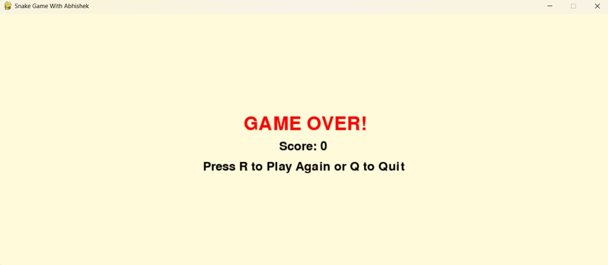
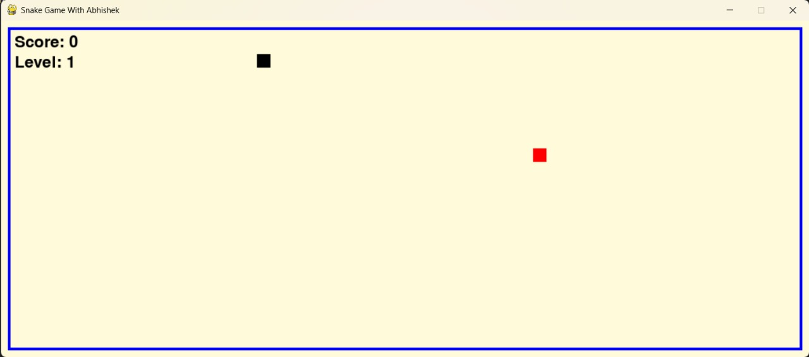

# 🐍 Snake Game with Abhishek

A modern version of the classic Snake Game built using **Python** and **Pygame**.  
This project marks my **first step into Game Development**, created to learn the basics of animation, collision, and user interaction.

## 🎮 Features

- Smooth arrow-key-controlled snake movement
- Randomly appearing food (red block)
- Score and Level system
- Snake grows after eating food
- Increasing speed as levels progress
- Game Over when the snake hits the boundary
- Restart option after Game Over
- Clean UI with boundary visuals

## 📸 Screenshots






## 🕹️ How to Play

- Use `Arrow Keys` (↑ ↓ ← →) to control the snake.
- Eat red blocks (food) to grow longer.
- The snake speeds up every 5 points (level up).
- Avoid crashing into the blue border (edges of the screen).
- After Game Over:
  - Press `Enter` to play again.
  - Press `Esc` to exit.

## 🚀 How to Run the Game

### 1. Clone or Download

```bash
git clone https://github.com/your-username/snake-game-abhishek.git
cd snake-game-abhishek
````

### 2. Install Dependencies
Make sure Python is installed (3.6+), then install Pygame:

```bash
pip install pygame
```

### 3. Run the Game

```bash
python snake_game.py
```

## 🧠 Code Overview

### Snake Movement and Growth

```python
snake_body.append(list(snake_pos))
if len(snake_body) > snake_length:
    del snake_body[0]
```

* The current position of the snake is added to its body list.
* The tail is removed if the body gets longer than the allowed snake length.

### Level System

```python
if score % level_up_score == 0:
    level += 1
    snake_speed += 1
```

* Every time the score is a multiple of 5, the level increases and so does the snake's speed.

## 🛠️ Built With

* **Python** – for logic and control
* **Pygame** – for rendering graphics and handling input

## 📁 Folder Structure
snake-game-abhishek/
├── snake_game.py       # Main game logic
├── README.md           # Game documentation
```
## 👨‍💻 About Me

Hi, I’m **Abhishek Mittal**, a BTech student at **JIIT (Batch 2026)**.
This is one of my **first GameDev projects**, where I learned how to animate, handle inputs, and implement basic game logic.

## ✅ TODO / Future Features

* Add high score tracking
* Add sound effects and background music
* Add obstacles and power-ups
* Add start and pause menus

## ⭐ Like This Project?

Give it a star ⭐ on GitHub and share it with friends who are also starting with game development!

